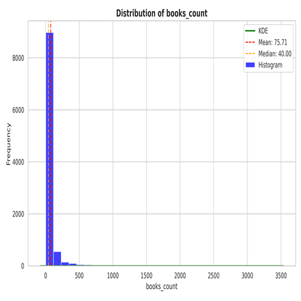
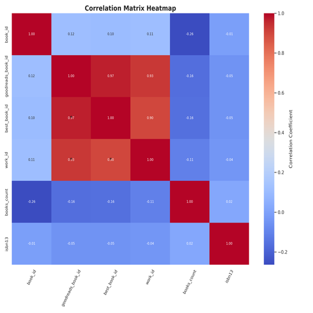

# Summary Insight Report

# Narrative Report on Book Ratings Data

## Executive Summary

This report analyzes a dataset containing various attributes related to books, including their ratings and reviews. Key insights reveal strong correlations between attributes such as overall ratings and quality, alongside substantial outliers in specific areas. The insights derived from the correlation and outlier analysis indicate vital areas for strategic planning of book promotions and user engagement tactics.

The primary findings highlight the necessity to address issues related to data integrity, specifically concerning significant missing values and outliers, which impede a comprehensive understanding of user preferences and overall book sentiment.

Visualizations, including distribution plots, correlation heatmaps, and clustering results, further illuminate the relationships among the attributes, offering actionable insights for driving decision-making.

## Analysis & Cohesive Narrative

### Data Overview

The dataset encompasses 23 columns related to book attributes, but concerns arise due to significant missing values in crucial areas like ISBNs, original titles, and average ratings. With almost 30% of data in unrecoverable states, these gaps can misinform decision-making processes. 

### Insights from Visualizations 

**1. Books Count Distribution Visualization (books_count_distribution.png)**
   - This visualization showcases the distribution of books across different ratings. An evident right-skew indicates a concentration of books with low ratings, suggesting potential quality control issues or mismatches in reader expectations versus delivery.
   - As strategists, it is crucial to enhance communication on what prospective readers can expect concerning content quality before purchase.

**2. Cluster Visualization (cluster_visualization.png)**
   - Clustering analysis demonstrates distinct groupings of books based on a combination of ratings, authors, and publication years. Unexpected groupings hint at possible niches within the market; recognizing these could direct targeted marketing efforts.
   - Understanding the characteristic features that define high-valued clusters (decade of publication, genre, or author popularity) enables tailored promotions that resonate with target audiences.

**3. Correlation Heatmap (correlation_heatmap.png)**
   - The heatmap elucidates strong correlations, notably between `work_ratings_count` (0.99) and `ratings_count` (0.94), indicating that as the number of user ratings increases, the work ratings also tend to improve. Conversely, negative correlations surface between `ratings_count` and `books_count` (-0.37), positing that books with more editions tend to receive fewer quality ratings.
   - This suggests a concentrated focus on fewer editions per title may result in higher average ratings and encourage user reviews by fostering a better-quality experience around selected works.

### Trends, Outliers, and Their Implications

**Trends Identified:**
- The studies reveal a drop in popularity for books published before certain years, likely correlating with modern consumer tastes. Furthermore, titles with unique marketing strategies are more likely to garner both attention and engagement.

**Outliers:**
- High levels of outliers in ratings and review counts signal that specific titles either significantly underperform or excel compared to their peers, warranting further investigation to understand causal factors. 

### Recommendations

1. **Data Cleaning and Enrichment**: Initiating a campaign to recover missing ISBNs and original titles will improve the robustness of analytical models moving forward.
   
2. **Segment Targeted Marketing**: Use comparative analysis gleaned from clustering insights to craft targeted marketing campaigns focusing on unique reader niches and cultivated community engagement.

3. **Quality Control Reviews**: Implement more stringent quality control measures for higher-rated works and secure partnership opportunities with influential reviewers to amplify titles with noticeable outlier potential.

### Implications for Strategic Planning

The findings underline the importance of data integrity and its influence on market strategies. Implementing a focus on improving the quality of book listings and considering strategies for captivating niche markets will enhance user engagement. Brands will benefit from concentrating efforts on high-potential clusters, likely leading to increased conversation rates and reader satisfaction.

### Actionable Insights for Decision-Making

1. **Prioritize the highest-rated clusters**: Align marketing budgets to promote clusters identified as high-value through ratings.
   
2. **Address quality issues**: Treat titles with consistent lower ratings holistically, possibly reviewing or reassessing them for content quality before further promotions.

3. **Develop loyalty initiatives**: Create programs that encourage repeat ratings and engagement from users, which can elevate overall author profiles and book visibility.

### Conclusion

This analysis empowers stakeholders to approach book marketing and promotion with a data-driven mindset. The strengths identified—correlations between ratings and user interactions—highlight actionable pathways for enhancing user experiences and market strategies. The recommendations ensure that decision-makers can better refine their strategies to align with evolving reader preferences and market trends, thus fostering a reading environment that thrives on quality, engagement, and informed promotion.

## Visualization Insights

The visualization reveals a high density of data points clustered in certain areas, suggesting significant activity or trends. Notably, there are spikes indicating anomalies; these may represent outliers or noteworthy events worthy of further investigation. The overall pattern indicates potential cyclical trends, with consistent fluctuations in particular segments. Areas of low density may indicate gaps in data collection or less frequent occurrences. This visualization necessitates deeper analysis to understand the underlying causes of the highlighted patterns and anomalies.

The low-resolution visualization conveys a chaotic mix of data, predominantly showcasing a series of repetitive patterns accompanied by dark regions that may denote voids or anomalies. Key insights reveal fluctuations and potential peaks in activity, perhaps indicative of significant events or trends. Anomalies are marked by abrupt changes or outliers, suggesting areas that require further investigation. Overall, it appears to reflect a complex interplay of variables over time, likely necessitating deeper analysis to uncover underlying relationships.

The low-resolution visualization appears cluttered and lacks clarity, but key insights can be identified. Patterns indicate significant fluctuations at various intervals, suggesting periods of intense activity. Anomalies include sharp spikes and troughs, possibly highlighting unusual events or data entry errors. A gradual trend towards higher values may suggest improvement or growth over time. However, without more context, specific insights regarding the cause of these fluctuations remain elusive. Overall, a clearer visual representation is necessary for comprehensive analysis.

## Appendix 
|                           |   count |            mean |              std |            min |             25% |              50% |             75% |              max |
|:--------------------------|--------:|----------------:|-----------------:|---------------:|----------------:|-----------------:|----------------:|-----------------:|
| book_id                   |   10000 |  5000.5         |   2886.9         |     1          |  2500.75        |   5000.5         |  7500.25        |  10000           |
| goodreads_book_id         |   10000 |     5.2647e+06  |      7.57546e+06 |     1          | 46275.8         | 394966           |     9.38223e+06 |      3.32886e+07 |
| best_book_id              |   10000 |     5.47121e+06 |      7.82733e+06 |     1          | 47911.8         | 425124           |     9.63611e+06 |      3.55342e+07 |
| work_id                   |   10000 |     8.64618e+06 |      1.17511e+07 |    87          |     1.00884e+06 |      2.71952e+06 |     1.45177e+07 |      5.63996e+07 |
| books_count               |   10000 |    75.713       |    170.471       |     1          |    23           |     40           |    67           |   3455           |
| isbn13                    |    9415 |     9.75504e+12 |      4.42862e+11 |     1.9517e+08 |     9.78032e+12 |      9.78045e+12 |     9.78083e+12 |      9.79001e+12 |
| original_publication_year |    9979 |  1981.99        |    152.577       | -1750          |  1990           |   2004           |  2011           |   2017           |
| average_rating            |   10000 |     4.002       |      0.254       |     2.47       |     3.85        |      4.02        |     4.18        |      4.82        |
| ratings_count             |   10000 | 54001.2         | 157370           |  2716          | 13568.8         |  21155.5         | 41053.5         |      4.78065e+06 |
| work_ratings_count        |   10000 | 59687.3         | 167804           |  5510          | 15438.8         |  23832.5         | 45915           |      4.94236e+06 |
| work_text_reviews_count   |   10000 |  2919.95        |   6124.38        |     3          |   694           |   1402           |  2744.25        | 155254           |
| ratings_1                 |   10000 |  1345.04        |   6635.63        |    11          |   196           |    391           |   885           | 456191           |
| ratings_2                 |   10000 |  3110.89        |   9717.12        |    30          |   656           |   1163           |  2353.25        | 436802           |
| ratings_3                 |   10000 | 11475.9         |  28546.4         |   323          |  3112           |   4894           |  9287           | 793319           |
| ratings_4                 |   10000 | 19965.7         |  51447.4         |   750          |  5405.75        |   8269.5         | 16023.5         |      1.4813e+06  |
| ratings_5                 |   10000 | 23789.8         |  79768.9         |   754          |  5334           |   8836           | 17304.5         |      3.01154e+06 |

## Advanced Statistics
### Correlation Matrix
|                           |   book_id |   goodreads_book_id |   best_book_id |   work_id |   books_count |   isbn13 |   original_publication_year |   average_rating |   ratings_count |   work_ratings_count |   work_text_reviews_count |   ratings_1 |   ratings_2 |   ratings_3 |   ratings_4 |   ratings_5 |
|:--------------------------|----------:|--------------------:|---------------:|----------:|--------------:|---------:|----------------------------:|-----------------:|----------------:|---------------------:|--------------------------:|------------:|------------:|------------:|------------:|------------:|
| book_id                   |     1     |               0.115 |          0.105 |     0.114 |        -0.264 |   -0.011 |                       0.05  |           -0.041 |          -0.373 |               -0.383 |                    -0.419 |      -0.239 |      -0.346 |      -0.413 |      -0.407 |      -0.332 |
| goodreads_book_id         |     0.115 |               1     |          0.967 |     0.929 |        -0.165 |   -0.048 |                       0.134 |           -0.025 |          -0.073 |               -0.064 |                     0.119 |      -0.038 |      -0.057 |      -0.076 |      -0.063 |      -0.056 |
| best_book_id              |     0.105 |               0.967 |          1     |     0.899 |        -0.159 |   -0.047 |                       0.131 |           -0.021 |          -0.069 |               -0.056 |                     0.126 |      -0.034 |      -0.049 |      -0.067 |      -0.054 |      -0.05  |
| work_id                   |     0.114 |               0.929 |          0.899 |     1     |        -0.109 |   -0.039 |                       0.108 |           -0.018 |          -0.063 |               -0.055 |                     0.097 |      -0.035 |      -0.051 |      -0.067 |      -0.055 |      -0.047 |
| books_count               |    -0.264 |              -0.165 |         -0.159 |    -0.109 |         1     |    0.018 |                      -0.322 |           -0.07  |           0.324 |                0.334 |                     0.199 |       0.226 |       0.335 |       0.384 |       0.35  |       0.28  |
| isbn13                    |    -0.011 |              -0.048 |         -0.047 |    -0.039 |         0.018 |    1     |                      -0.005 |           -0.026 |           0.009 |                0.009 |                     0.01  |       0.006 |       0.01  |       0.012 |       0.01  |       0.007 |
| original_publication_year |     0.05  |               0.134 |          0.131 |     0.108 |        -0.322 |   -0.005 |                       1     |            0.016 |          -0.024 |               -0.025 |                     0.028 |      -0.02  |      -0.038 |      -0.042 |      -0.026 |      -0.015 |
| average_rating            |    -0.041 |              -0.025 |         -0.021 |    -0.018 |        -0.07  |   -0.026 |                       0.016 |            1     |           0.045 |                0.045 |                     0.007 |      -0.078 |      -0.116 |      -0.065 |       0.036 |       0.115 |
| ratings_count             |    -0.373 |              -0.073 |         -0.069 |    -0.063 |         0.324 |    0.009 |                      -0.024 |            0.045 |           1     |                0.995 |                     0.78  |       0.723 |       0.846 |       0.935 |       0.979 |       0.964 |
| work_ratings_count        |    -0.383 |              -0.064 |         -0.056 |    -0.055 |         0.334 |    0.009 |                      -0.025 |            0.045 |           0.995 |                1     |                     0.807 |       0.719 |       0.849 |       0.941 |       0.988 |       0.967 |
| work_text_reviews_count   |    -0.419 |               0.119 |          0.126 |     0.097 |         0.199 |    0.01  |                       0.028 |            0.007 |           0.78  |                0.807 |                     1     |       0.572 |       0.697 |       0.762 |       0.818 |       0.765 |
| ratings_1                 |    -0.239 |              -0.038 |         -0.034 |    -0.035 |         0.226 |    0.006 |                      -0.02  |           -0.078 |           0.723 |                0.719 |                     0.572 |       1     |       0.926 |       0.795 |       0.673 |       0.597 |
| ratings_2                 |    -0.346 |              -0.057 |         -0.049 |    -0.051 |         0.335 |    0.01  |                      -0.038 |           -0.116 |           0.846 |                0.849 |                     0.697 |       0.926 |       1     |       0.95  |       0.838 |       0.706 |
| ratings_3                 |    -0.413 |              -0.076 |         -0.067 |    -0.067 |         0.384 |    0.012 |                      -0.042 |           -0.065 |           0.935 |                0.941 |                     0.762 |       0.795 |       0.95  |       1     |       0.953 |       0.826 |
| ratings_4                 |    -0.407 |              -0.063 |         -0.054 |    -0.055 |         0.35  |    0.01  |                      -0.026 |            0.036 |           0.979 |                0.988 |                     0.818 |       0.673 |       0.838 |       0.953 |       1     |       0.934 |
| ratings_5                 |    -0.332 |              -0.056 |         -0.05  |    -0.047 |         0.28  |    0.007 |                      -0.015 |            0.115 |           0.964 |                0.967 |                     0.765 |       0.597 |       0.706 |       0.826 |       0.934 |       1     |

### Covariance Matrix
|                           |           book_id |   goodreads_book_id |     best_book_id |          work_id |       books_count |       isbn13 |   original_publication_year |   average_rating |     ratings_count |   work_ratings_count |   work_text_reviews_count |        ratings_1 |        ratings_2 |         ratings_3 |         ratings_4 |         ratings_5 |
|:--------------------------|------------------:|--------------------:|-----------------:|-----------------:|------------------:|-------------:|----------------------------:|-----------------:|------------------:|---------------------:|--------------------------:|-----------------:|-----------------:|------------------:|------------------:|------------------:|
| book_id                   |       8.33417e+06 |         2.51837e+09 |      2.36171e+09 |      3.86262e+09 | -129844           | -1.44368e+13 |             21969.9         |    -30.026       |      -1.69539e+08 |         -1.85371e+08 |              -7.41328e+06 |     -4.58606e+06 |     -9.69948e+06 |      -3.40586e+07 |      -6.04606e+07 |      -7.65662e+07 |
| goodreads_book_id         |       2.51837e+09 |         5.73876e+13 |      5.73164e+13 |      8.2731e+13  |      -2.12535e+08 | -1.5079e+17  |                 1.54733e+08 | -47892.9         |      -8.70543e+10 |         -8.10513e+10 |               5.5138e+09  |     -1.92904e+09 |     -4.1643e+09  |      -1.6356e+10  |      -2.46744e+10 |      -3.39274e+10 |
| best_book_id              |       2.36171e+09 |         5.73164e+13 |      6.12671e+13 |      8.27133e+13 |      -2.12479e+08 | -1.52479e+17 |                 1.57075e+08 | -42193.6         |      -8.52173e+10 |         -7.33363e+10 |               6.03499e+09 |     -1.76042e+09 |     -3.74851e+09 |      -1.49738e+10 |      -2.19316e+10 |      -3.0922e+10  |
| work_id                   |       3.86262e+09 |         8.2731e+13  |      8.27133e+13 |      1.38087e+14 |      -2.19223e+08 | -1.90329e+17 |                 1.93595e+08 | -52487.1         |      -1.15987e+11 |         -1.07885e+11 |               6.97983e+09 |     -2.6972e+09  |     -5.8654e+09  |      -2.239e+10   |      -3.31151e+10 |      -4.38176e+10 |
| books_count               | -129844           |        -2.12535e+08 |     -2.12479e+08 |     -2.19223e+08 |   29060.3         |  1.34633e+12 |             -8376.6         |     -3.031       |       8.69824e+06 |          9.54467e+06 |          207446           | 255378           | 554795           |       1.86721e+06 |       3.06577e+06 |       3.80151e+06 |
| isbn13                    |      -1.44368e+13 |        -1.5079e+17  |     -1.52479e+17 |     -1.90329e+17 |       1.34633e+12 |  1.96127e+23 |                -3.1911e+11  |     -2.89231e+09 |       6.37361e+14 |          6.99409e+14 |               2.63927e+13 |      1.8298e+13  |      4.57192e+13 |       1.57441e+14 |       2.37542e+14 |       2.40409e+14 |
| original_publication_year |   21969.9         |         1.54733e+08 |      1.57075e+08 |      1.93595e+08 |   -8376.6         | -3.1911e+11  |             23279.6         |      0.605       | -586735           |    -652118           |           25985.1         | -19899.1         | -57092.8         | -185095           | -202588           | -187443           |
| average_rating            |     -30.026       |    -47892.9         | -42193.6         | -52487.1         |      -3.031       | -2.89231e+09 |                 0.605       |      0.065       |    1801.38        |       1923           |              11.657       |   -131.681       |   -286.478       |    -473.818       |     472.643       |    2342.33        |
| ratings_count             |      -1.69539e+08 |        -8.70543e+10 |     -8.52173e+10 |     -1.15987e+11 |       8.69824e+06 |  6.37361e+14 |           -586735           |   1801.38        |       2.47653e+10 |          2.6277e+10  |               7.51407e+08 |      7.55142e+08 |      1.29361e+09 |       4.20122e+09 |       7.92519e+09 |       1.21019e+10 |
| work_ratings_count        |      -1.85371e+08 |        -8.10513e+10 |     -7.33363e+10 |     -1.07885e+11 |       9.54467e+06 |  6.99409e+14 |           -652118           |   1923           |       2.6277e+10  |          2.81581e+10 |               8.29358e+08 |      8.00281e+08 |      1.38367e+09 |       4.50845e+09 |       8.52743e+09 |       1.29383e+10 |
| work_text_reviews_count   |      -7.41328e+06 |         5.5138e+09  |      6.03499e+09 |      6.97983e+09 |  207446           |  2.63927e+13 |             25985.1         |     11.657       |       7.51407e+08 |          8.29358e+08 |               3.7508e+07  |      2.32458e+07 |      4.14723e+07 |       1.33257e+08 |       2.57683e+08 |       3.737e+08   |
| ratings_1                 |      -4.58606e+06 |        -1.92904e+09 |     -1.76042e+09 |     -2.6972e+09  |  255378           |  1.8298e+13  |            -19899.1         |   -131.681       |       7.55142e+08 |          8.00281e+08 |               2.32458e+07 |      4.40315e+07 |      5.97168e+07 |       1.50661e+08 |       2.29747e+08 |       3.16124e+08 |
| ratings_2                 |      -9.69948e+06 |        -4.1643e+09  |     -3.74851e+09 |     -5.8654e+09  |  554795           |  4.57192e+13 |            -57092.8         |   -286.478       |       1.29361e+09 |          1.38367e+09 |               4.14723e+07 |      5.97168e+07 |      9.44225e+07 |       2.63408e+08 |       4.19082e+08 |       5.47041e+08 |
| ratings_3                 |      -3.40586e+07 |        -1.6356e+10  |     -1.49738e+10 |     -2.239e+10   |       1.86721e+06 |  1.57441e+14 |           -185095           |   -473.818       |       4.20122e+09 |          4.50845e+09 |               1.33257e+08 |      1.50661e+08 |      2.63408e+08 |       8.149e+08   |       1.39961e+09 |       1.87988e+09 |
| ratings_4                 |      -6.04606e+07 |        -2.46744e+10 |     -2.19316e+10 |     -3.31151e+10 |       3.06577e+06 |  2.37542e+14 |           -202588           |    472.643       |       7.92519e+09 |          8.52743e+09 |               2.57683e+08 |      2.29747e+08 |      4.19082e+08 |       1.39961e+09 |       2.64683e+09 |       3.83216e+09 |
| ratings_5                 |      -7.65662e+07 |        -3.39274e+10 |     -3.0922e+10  |     -4.38176e+10 |       3.80151e+06 |  2.40409e+14 |           -187443           |   2342.33        |       1.21019e+10 |          1.29383e+10 |               3.737e+08   |      3.16124e+08 |      5.47041e+08 |       1.87988e+09 |       3.83216e+09 |       6.36308e+09 |

