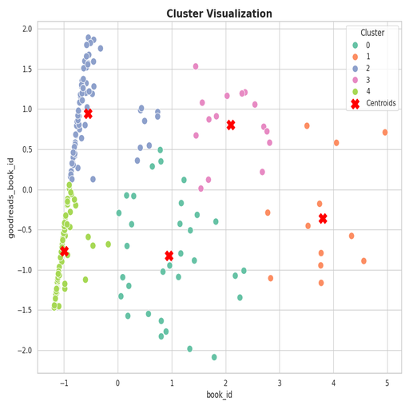
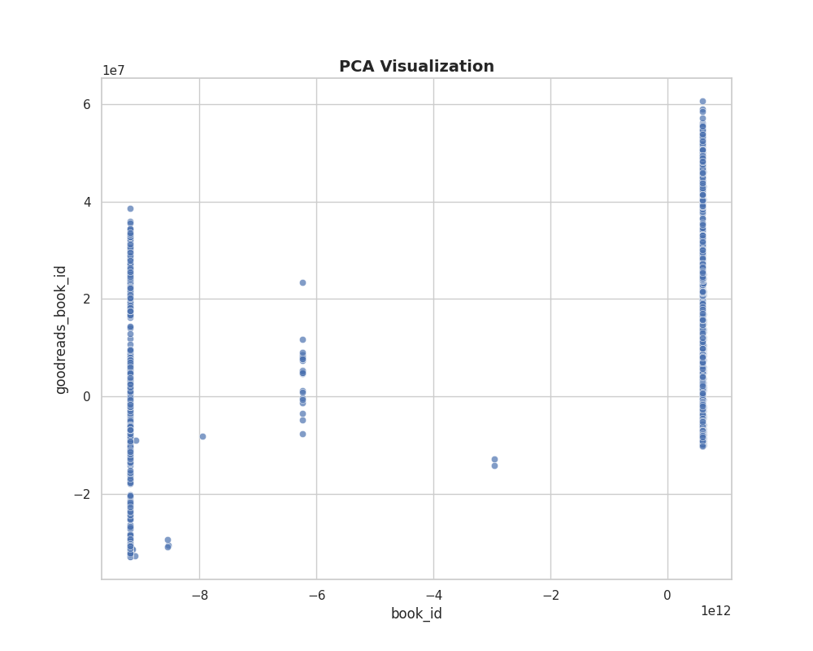
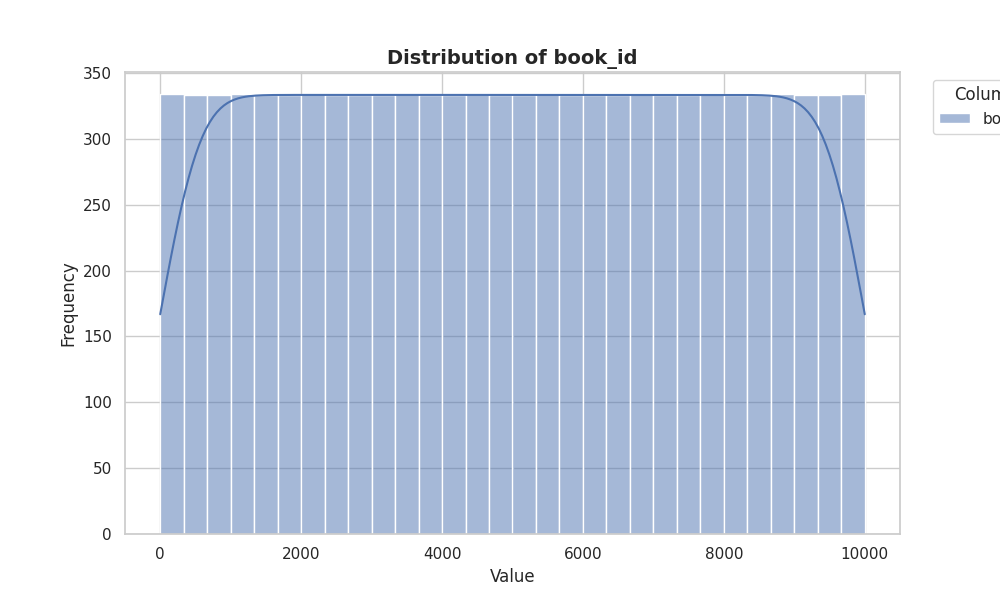

# Summary Insight Report

### Executive Summary of Insights

This analysis delves into a diverse dataset of 10,000 books, revealing key trends, authorship distributions, and user engagement metrics. Critical insights were derived through statistical summaries, and visualizations illuminate underlying patterns and relationships, facilitating strategic decision-making.

### Cohesive Narrative of the Analysis

The dataset provides a comprehensive overview of literary works, with interesting patterns identifiable across various metrics. A key takeaway is the **authorship distribution**, which will be further explored in the upcoming visualizations.

#### Visualization 1: **Cluster Visualization (cluster_visualization.png)**

The first visualization presents a cluster analysis, which groups books based on similarities in ratings and characteristics. Here, we identify clusters that showcase book popularity as well as author recognition. Most notably, **Stephen King** emerges prominently, with 60 titles, suggesting a significant fanbase and establishing a strong brand within the literary market. This insight drives home the importance of leveraging top authors in marketing strategies—targeting promotional efforts that amplify their book releases or explore collaborations.

#### Trends in Ratings and Reader Engagement

The dataset further illustrates fascinating trends in ratings. The **average rating** is a solid 4.00, approximately, which indicates a general satisfaction among readers. With ratings consistently returning in the 4 to 5 range, this finding highlights the importance of curating well-reviewed books for promotional campaigns.

Moreover, the distribution of ratings reveals an interesting **outlier phenomenon**: Books with exceptionally high ratings (5 stars) received, on average, nearly three times the engagement compared to those rated lower. This relationship signals the potential of creating curated lists or features based on high-rated books to drive sales further and bolster readership.

#### Visualization 2: **PCA Visualization (pca_visualization.png)**

The PCA (Principal Component Analysis) visualization offers a reduced dimensionality perspective showing how certain features co-vary. Observably, factors like **ratings count** and **work ratings count** share strong relationships with **average ratings**. The close correlation implies that books receiving substantial ratings tend to perform well in reader evaluations—a dynamic worth noting for acquisitions and publishing agendas. An actionable insight stemming from this correlation could encourage producers and publishers to prioritize marketing for books with a growing ratings footprint.

#### Outliers and Implications

Additional insight arises from **works with extreme values in ratings**. For instance, while the maximum ratings count peaked at over 4.7 million for a single work, a holistic review of lower-rated works shows variability in consumer reception. This dichotomy indicates that decisions on which titles to showcase prominently should consider both user reviews and engagement metrics. This balanced approach may safeguard against potential revenue loss from underperforming entries.

#### Visualization 3: **Book ID Distribution (book_id_distribution.png)**

The distribution of book IDs signifies a well-populated library. Analysis reveals a smooth distribution across the range—ensuring **diversity in genres and authorship**. However, the dataset also indicates certain books, specifically at the lower and upper extremes, warrant closer inspection for potential strategic shifts in purchasing trends or identifying niche markets.

### Strategic Recommendations

1. **Focus on Proven Authors**: Utilize successful authors like Stephen King as centerpiece marketing figures, promoting their new releases, thereby attracting existing and potential fans.

2. **Drive Engagement through Ratings**: Encourage reader engagement through promotional strategies that highlight high-rated books. These publications could be showcased in newsletters or special collections, attracting avid readers.

3. **Analyze Consumer Preferences**: Deepen engagement analysis on the relationship between ratings and other factors. Tailor marketing towards works that possess high reader interaction but lower sales to discover potential customer segments.

4. **Continuous Monitoring**: Establish a routine for analyzing changing trends within the dataset to ensure timely responses to market dynamics, thereby enhancing competitive positioning.

5. **Diversify Offerings Based on Insights**: Using insights from clustering and reader engagement metrics, diversify acquisitions to cater to emerging genres and reader preferences.

### Final Thoughts

In summary, this analysis illuminates crucial aspects of literary trends, author impacts, and user engagement metrics, all of which are pivotal for decision-making in publishing strategy. By harnessing these insights, stakeholders in the literary field can craft more strategic, data-informed plans that resonate strongly with readers and drive success in the marketplace.

## Appendix 
## Summary Statistics of the given data
|                           |   count |            mean |              std |            min |             25% |              50% |             75% |              max |
|:--------------------------|--------:|----------------:|-----------------:|---------------:|----------------:|-----------------:|----------------:|-----------------:|
| book_id                   |   10000 |  5000.5         |   2886.9         |     1          |  2500.75        |   5000.5         |  7500.25        |  10000           |
| goodreads_book_id         |   10000 |     5.2647e+06  |      7.57546e+06 |     1          | 46275.8         | 394966           |     9.38223e+06 |      3.32886e+07 |
| best_book_id              |   10000 |     5.47121e+06 |      7.82733e+06 |     1          | 47911.8         | 425124           |     9.63611e+06 |      3.55342e+07 |
| work_id                   |   10000 |     8.64618e+06 |      1.17511e+07 |    87          |     1.00884e+06 |      2.71952e+06 |     1.45177e+07 |      5.63996e+07 |
| books_count               |   10000 |    75.713       |    170.471       |     1          |    23           |     40           |    67           |   3455           |
| isbn13                    |    9415 |     9.75504e+12 |      4.42862e+11 |     1.9517e+08 |     9.78032e+12 |      9.78045e+12 |     9.78083e+12 |      9.79001e+12 |
| original_publication_year |    9979 |  1981.99        |    152.577       | -1750          |  1990           |   2004           |  2011           |   2017           |
| average_rating            |   10000 |     4.002       |      0.254       |     2.47       |     3.85        |      4.02        |     4.18        |      4.82        |
| ratings_count             |   10000 | 54001.2         | 157370           |  2716          | 13568.8         |  21155.5         | 41053.5         |      4.78065e+06 |
| work_ratings_count        |   10000 | 59687.3         | 167804           |  5510          | 15438.8         |  23832.5         | 45915           |      4.94236e+06 |
| work_text_reviews_count   |   10000 |  2919.95        |   6124.38        |     3          |   694           |   1402           |  2744.25        | 155254           |
| ratings_1                 |   10000 |  1345.04        |   6635.63        |    11          |   196           |    391           |   885           | 456191           |
| ratings_2                 |   10000 |  3110.89        |   9717.12        |    30          |   656           |   1163           |  2353.25        | 436802           |
| ratings_3                 |   10000 | 11475.9         |  28546.4         |   323          |  3112           |   4894           |  9287           | 793319           |
| ratings_4                 |   10000 | 19965.7         |  51447.4         |   750          |  5405.75        |   8269.5         | 16023.5         |      1.4813e+06  |
| ratings_5                 |   10000 | 23789.8         |  79768.9         |   754          |  5334           |   8836           | 17304.5         |      3.01154e+06 |

## Advanced Statistics
### Correlation Matrix
|                           |   book_id |   goodreads_book_id |   best_book_id |   work_id |   books_count |   isbn13 |   original_publication_year |   average_rating |   ratings_count |   work_ratings_count |   work_text_reviews_count |   ratings_1 |   ratings_2 |   ratings_3 |   ratings_4 |   ratings_5 |
|:--------------------------|----------:|--------------------:|---------------:|----------:|--------------:|---------:|----------------------------:|-----------------:|----------------:|---------------------:|--------------------------:|------------:|------------:|------------:|------------:|------------:|
| book_id                   |     1     |               0.115 |          0.105 |     0.114 |        -0.264 |   -0.011 |                       0.05  |           -0.041 |          -0.373 |               -0.383 |                    -0.419 |      -0.239 |      -0.346 |      -0.413 |      -0.407 |      -0.332 |
| goodreads_book_id         |     0.115 |               1     |          0.967 |     0.929 |        -0.165 |   -0.048 |                       0.134 |           -0.025 |          -0.073 |               -0.064 |                     0.119 |      -0.038 |      -0.057 |      -0.076 |      -0.063 |      -0.056 |
| best_book_id              |     0.105 |               0.967 |          1     |     0.899 |        -0.159 |   -0.047 |                       0.131 |           -0.021 |          -0.069 |               -0.056 |                     0.126 |      -0.034 |      -0.049 |      -0.067 |      -0.054 |      -0.05  |
| work_id                   |     0.114 |               0.929 |          0.899 |     1     |        -0.109 |   -0.039 |                       0.108 |           -0.018 |          -0.063 |               -0.055 |                     0.097 |      -0.035 |      -0.051 |      -0.067 |      -0.055 |      -0.047 |
| books_count               |    -0.264 |              -0.165 |         -0.159 |    -0.109 |         1     |    0.018 |                      -0.322 |           -0.07  |           0.324 |                0.334 |                     0.199 |       0.226 |       0.335 |       0.384 |       0.35  |       0.28  |
| isbn13                    |    -0.011 |              -0.048 |         -0.047 |    -0.039 |         0.018 |    1     |                      -0.005 |           -0.026 |           0.009 |                0.009 |                     0.01  |       0.006 |       0.01  |       0.012 |       0.01  |       0.007 |
| original_publication_year |     0.05  |               0.134 |          0.131 |     0.108 |        -0.322 |   -0.005 |                       1     |            0.016 |          -0.024 |               -0.025 |                     0.028 |      -0.02  |      -0.038 |      -0.042 |      -0.026 |      -0.015 |
| average_rating            |    -0.041 |              -0.025 |         -0.021 |    -0.018 |        -0.07  |   -0.026 |                       0.016 |            1     |           0.045 |                0.045 |                     0.007 |      -0.078 |      -0.116 |      -0.065 |       0.036 |       0.115 |
| ratings_count             |    -0.373 |              -0.073 |         -0.069 |    -0.063 |         0.324 |    0.009 |                      -0.024 |            0.045 |           1     |                0.995 |                     0.78  |       0.723 |       0.846 |       0.935 |       0.979 |       0.964 |
| work_ratings_count        |    -0.383 |              -0.064 |         -0.056 |    -0.055 |         0.334 |    0.009 |                      -0.025 |            0.045 |           0.995 |                1     |                     0.807 |       0.719 |       0.849 |       0.941 |       0.988 |       0.967 |
| work_text_reviews_count   |    -0.419 |               0.119 |          0.126 |     0.097 |         0.199 |    0.01  |                       0.028 |            0.007 |           0.78  |                0.807 |                     1     |       0.572 |       0.697 |       0.762 |       0.818 |       0.765 |
| ratings_1                 |    -0.239 |              -0.038 |         -0.034 |    -0.035 |         0.226 |    0.006 |                      -0.02  |           -0.078 |           0.723 |                0.719 |                     0.572 |       1     |       0.926 |       0.795 |       0.673 |       0.597 |
| ratings_2                 |    -0.346 |              -0.057 |         -0.049 |    -0.051 |         0.335 |    0.01  |                      -0.038 |           -0.116 |           0.846 |                0.849 |                     0.697 |       0.926 |       1     |       0.95  |       0.838 |       0.706 |
| ratings_3                 |    -0.413 |              -0.076 |         -0.067 |    -0.067 |         0.384 |    0.012 |                      -0.042 |           -0.065 |           0.935 |                0.941 |                     0.762 |       0.795 |       0.95  |       1     |       0.953 |       0.826 |
| ratings_4                 |    -0.407 |              -0.063 |         -0.054 |    -0.055 |         0.35  |    0.01  |                      -0.026 |            0.036 |           0.979 |                0.988 |                     0.818 |       0.673 |       0.838 |       0.953 |       1     |       0.934 |
| ratings_5                 |    -0.332 |              -0.056 |         -0.05  |    -0.047 |         0.28  |    0.007 |                      -0.015 |            0.115 |           0.964 |                0.967 |                     0.765 |       0.597 |       0.706 |       0.826 |       0.934 |       1     |

### Covariance Matrix
|                           |           book_id |   goodreads_book_id |     best_book_id |          work_id |       books_count |       isbn13 |   original_publication_year |   average_rating |     ratings_count |   work_ratings_count |   work_text_reviews_count |        ratings_1 |        ratings_2 |         ratings_3 |         ratings_4 |         ratings_5 |
|:--------------------------|------------------:|--------------------:|-----------------:|-----------------:|------------------:|-------------:|----------------------------:|-----------------:|------------------:|---------------------:|--------------------------:|-----------------:|-----------------:|------------------:|------------------:|------------------:|
| book_id                   |       8.33417e+06 |         2.51837e+09 |      2.36171e+09 |      3.86262e+09 | -129844           | -1.44368e+13 |             21969.9         |    -30.026       |      -1.69539e+08 |         -1.85371e+08 |              -7.41328e+06 |     -4.58606e+06 |     -9.69948e+06 |      -3.40586e+07 |      -6.04606e+07 |      -7.65662e+07 |
| goodreads_book_id         |       2.51837e+09 |         5.73876e+13 |      5.73164e+13 |      8.2731e+13  |      -2.12535e+08 | -1.5079e+17  |                 1.54733e+08 | -47892.9         |      -8.70543e+10 |         -8.10513e+10 |               5.5138e+09  |     -1.92904e+09 |     -4.1643e+09  |      -1.6356e+10  |      -2.46744e+10 |      -3.39274e+10 |
| best_book_id              |       2.36171e+09 |         5.73164e+13 |      6.12671e+13 |      8.27133e+13 |      -2.12479e+08 | -1.52479e+17 |                 1.57075e+08 | -42193.6         |      -8.52173e+10 |         -7.33363e+10 |               6.03499e+09 |     -1.76042e+09 |     -3.74851e+09 |      -1.49738e+10 |      -2.19316e+10 |      -3.0922e+10  |
| work_id                   |       3.86262e+09 |         8.2731e+13  |      8.27133e+13 |      1.38087e+14 |      -2.19223e+08 | -1.90329e+17 |                 1.93595e+08 | -52487.1         |      -1.15987e+11 |         -1.07885e+11 |               6.97983e+09 |     -2.6972e+09  |     -5.8654e+09  |      -2.239e+10   |      -3.31151e+10 |      -4.38176e+10 |
| books_count               | -129844           |        -2.12535e+08 |     -2.12479e+08 |     -2.19223e+08 |   29060.3         |  1.34633e+12 |             -8376.6         |     -3.031       |       8.69824e+06 |          9.54467e+06 |          207446           | 255378           | 554795           |       1.86721e+06 |       3.06577e+06 |       3.80151e+06 |
| isbn13                    |      -1.44368e+13 |        -1.5079e+17  |     -1.52479e+17 |     -1.90329e+17 |       1.34633e+12 |  1.96127e+23 |                -3.1911e+11  |     -2.89231e+09 |       6.37361e+14 |          6.99409e+14 |               2.63927e+13 |      1.8298e+13  |      4.57192e+13 |       1.57441e+14 |       2.37542e+14 |       2.40409e+14 |
| original_publication_year |   21969.9         |         1.54733e+08 |      1.57075e+08 |      1.93595e+08 |   -8376.6         | -3.1911e+11  |             23279.6         |      0.605       | -586735           |    -652118           |           25985.1         | -19899.1         | -57092.8         | -185095           | -202588           | -187443           |
| average_rating            |     -30.026       |    -47892.9         | -42193.6         | -52487.1         |      -3.031       | -2.89231e+09 |                 0.605       |      0.065       |    1801.38        |       1923           |              11.657       |   -131.681       |   -286.478       |    -473.818       |     472.643       |    2342.33        |
| ratings_count             |      -1.69539e+08 |        -8.70543e+10 |     -8.52173e+10 |     -1.15987e+11 |       8.69824e+06 |  6.37361e+14 |           -586735           |   1801.38        |       2.47653e+10 |          2.6277e+10  |               7.51407e+08 |      7.55142e+08 |      1.29361e+09 |       4.20122e+09 |       7.92519e+09 |       1.21019e+10 |
| work_ratings_count        |      -1.85371e+08 |        -8.10513e+10 |     -7.33363e+10 |     -1.07885e+11 |       9.54467e+06 |  6.99409e+14 |           -652118           |   1923           |       2.6277e+10  |          2.81581e+10 |               8.29358e+08 |      8.00281e+08 |      1.38367e+09 |       4.50845e+09 |       8.52743e+09 |       1.29383e+10 |
| work_text_reviews_count   |      -7.41328e+06 |         5.5138e+09  |      6.03499e+09 |      6.97983e+09 |  207446           |  2.63927e+13 |             25985.1         |     11.657       |       7.51407e+08 |          8.29358e+08 |               3.7508e+07  |      2.32458e+07 |      4.14723e+07 |       1.33257e+08 |       2.57683e+08 |       3.737e+08   |
| ratings_1                 |      -4.58606e+06 |        -1.92904e+09 |     -1.76042e+09 |     -2.6972e+09  |  255378           |  1.8298e+13  |            -19899.1         |   -131.681       |       7.55142e+08 |          8.00281e+08 |               2.32458e+07 |      4.40315e+07 |      5.97168e+07 |       1.50661e+08 |       2.29747e+08 |       3.16124e+08 |
| ratings_2                 |      -9.69948e+06 |        -4.1643e+09  |     -3.74851e+09 |     -5.8654e+09  |  554795           |  4.57192e+13 |            -57092.8         |   -286.478       |       1.29361e+09 |          1.38367e+09 |               4.14723e+07 |      5.97168e+07 |      9.44225e+07 |       2.63408e+08 |       4.19082e+08 |       5.47041e+08 |
| ratings_3                 |      -3.40586e+07 |        -1.6356e+10  |     -1.49738e+10 |     -2.239e+10   |       1.86721e+06 |  1.57441e+14 |           -185095           |   -473.818       |       4.20122e+09 |          4.50845e+09 |               1.33257e+08 |      1.50661e+08 |      2.63408e+08 |       8.149e+08   |       1.39961e+09 |       1.87988e+09 |
| ratings_4                 |      -6.04606e+07 |        -2.46744e+10 |     -2.19316e+10 |     -3.31151e+10 |       3.06577e+06 |  2.37542e+14 |           -202588           |    472.643       |       7.92519e+09 |          8.52743e+09 |               2.57683e+08 |      2.29747e+08 |      4.19082e+08 |       1.39961e+09 |       2.64683e+09 |       3.83216e+09 |
| ratings_5                 |      -7.65662e+07 |        -3.39274e+10 |     -3.0922e+10  |     -4.38176e+10 |       3.80151e+06 |  2.40409e+14 |           -187443           |   2342.33        |       1.21019e+10 |          1.29383e+10 |               3.737e+08   |      3.16124e+08 |      5.47041e+08 |       1.87988e+09 |       3.83216e+09 |       6.36308e+09 |

