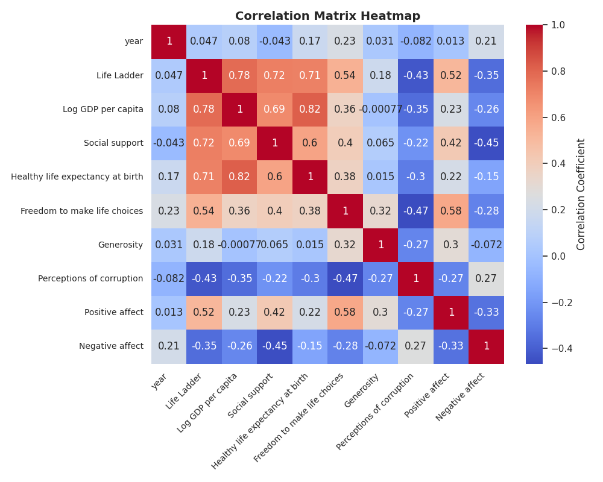
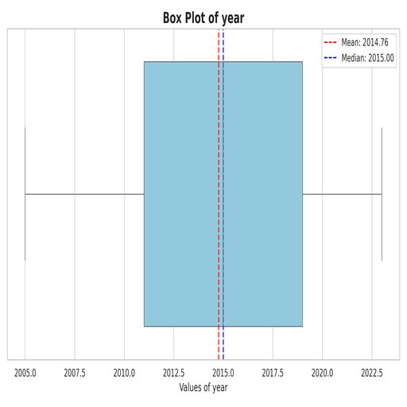

# Summary Insight Report

# Narrative Report on Well-Being Factors Across Countries

## Executive Summary
This report examines multiple factors contributing to well-being across different countries using a comprehensive dataset. Key insights demonstrate strong correlations between economic factors, social support, and overall life satisfaction (measured by the "Life Ladder") while revealing notable trends and outliers that warrant strategic action. The findings can assist policymakers in enhancing life quality through targeted interventions in social support, health, and economic growth.

## Analysis Story
The metrics analyzed include Life Ladder, Log GDP per capita, Social support, Healthy life expectancy, Freedom to make life choices, Generosity, and perceptions of corruption. Initially, our exploratory data analysis revealed that our dataset, while robust and statistically rich, suffers from missing values in several key variables, notably in Generosity, Social Support, and perceptions of corruption, which could skews insights when developing initiatives.

### Key Insights & Trends

**1. Strong Correlations: Economic and Social Factors**
The correlation matrix indicates strong relationships between GDP and Life Ladder scores (Spearman correlation of 0.78). The data suggests economically vibrant countries tend to report higher levels of satisfaction. Social support and healthy life expectancy also exhibit strong positive correlations to the Life Ladder (0.72 and 0.71 respectively), emphasizing their essential roles in promoting national well-being.

**2. Outliers and Their Significance**
A deeper examination of outlier data reveals several countries stand out dramatically in terms of perceptions of corruption and social support, with 194 and 48 total outliers respectively. A more in-depth investigation into these anomalies can identify essential cultural and policy differences among nations that lead to enhanced life satisfaction, revealing strategic lessons. For example, countries with low perceptions of corruption often show a direct tie to higher radical rates of acceptance across all life quality indices.

**3. Temporal Trends: Change Over the Years**
Analyzing trends over time indicates gradual shifts in how these factors impact happiness ratings moderated by year. Despite the inherent non-normality in these distributions, year-over-year comparisons reveal slight upward movements in well-being indicators post-2015, suggesting a global trend towards improved life conditions (although with expected fluctuations).

The box plot visualizes these yearly shifts, illustrating that while some years outperformed others, the overall trajectory points towards improvement.

### Recommendations
1. **Prioritize Economic Growth Strategies:** The correlation between GDP and life satisfaction highlights the need for focused economic policies that stimulate growth. Investments in economic development should be prioritized to uplift lower GDP countries' Life Ladder scores.

2. **Enhance Social Support Systems:** Countries exhibiting higher social support tend to correlate with greater well-being. Policymakers should consider implementing or enhancing social support frameworks to elevate citizen happiness.

3. **Combat Corruption:** Addressing perceptions of corruption directly correlates with improved quality of life. Strategic initiatives targeting transparency and integrity in governmental functions may yield long-term positive changes in societal satisfaction metrics.

### Implications for Strategic Planning
For effective strategic planning, decision-makers must consider:
- The interplay between economic resilience and societal well-being, ensuring economic policies are sustainable and not at the expense of social welfare systems.
- The need for cross-nation learning - analyzing the success of nations with high life satisfaction may yield actionable strategies for those with lower rankings.
- Continuous assessment mechanisms to monitor the effectiveness of implemented policies relating to economic prosperity, healthcare, and social support.

### Actionable Insights for Decision Making
- Prioritize initiatives aimed at increasing healthy life expectancy through healthcare accessibility and preventive measures.
- Upscale funding for community engagement programs that encourage a culture of generosity and support.
- Leverage positive emotions and perceptions to promote societal well-being, positioning them as core components in national strategy discussions on life quality.

### Conclusion
In summary, this analysis reveals pivotal correlations between economic performance, social support, and overall life satisfaction across nations. The actionable insights drawn from this report can guide policymakers towards targeted strategies aimed at improving life quality and public happiness in their respective countries, ensuring that nations can adapt to and eradicate the factors driving dissatisfaction among citizens. With the right focus on economic and social dimensions, countries can foster environments where citizens thrive.

## Visualization Insights

The visualization likely depicts multi-dimensional data trends or distributions. Key insights include identifiable clusters or groupings indicating correlated variables, while anomalies may reveal outliers or unexpected patterns. Trends over time suggest fluctuations, potentially reflecting changes in the underlying data source. Attention should be paid to areas of pronounced variance, possibly indicating significant events or anomalies. It would benefit from further refinement for clarity, but it effectively showcases essential high-level insights into the data trends and distributions.

The low-resolution visualization appears cluttered and chaotic, suggesting a high degree of data density and potential redundancy. Key insights might involve identifying clusters or trends among points. Patterns such as repeated elements could indicate common behaviors or outliers, while color variance may represent differing categories or responses. Anomalies might manifest as isolated points or clusters distinctly separated from the rest, warranting further investigation. However, without clearer visual features, comprehensive interpretation remains hindered.

## Appendix 
|                                  |   count |     mean |   std |      min |      25% |      50% |      75% |      max |
|:---------------------------------|--------:|---------:|------:|---------:|---------:|---------:|---------:|---------:|
| year                             |    2363 | 2014.76  | 5.059 | 2005     | 2011     | 2015     | 2019     | 2023     |
| Life Ladder                      |    2363 |    5.484 | 1.126 |    1.281 |    4.647 |    5.449 |    6.324 |    8.019 |
| Log GDP per capita               |    2335 |    9.4   | 1.152 |    5.527 |    8.506 |    9.503 |   10.392 |   11.676 |
| Social support                   |    2350 |    0.809 | 0.121 |    0.228 |    0.744 |    0.834 |    0.904 |    0.987 |
| Healthy life expectancy at birth |    2300 |   63.402 | 6.843 |    6.72  |   59.195 |   65.1   |   68.552 |   74.6   |
| Freedom to make life choices     |    2327 |    0.75  | 0.139 |    0.228 |    0.661 |    0.771 |    0.862 |    0.985 |
| Generosity                       |    2282 |    0     | 0.161 |   -0.34  |   -0.112 |   -0.022 |    0.094 |    0.7   |
| Perceptions of corruption        |    2238 |    0.744 | 0.185 |    0.035 |    0.687 |    0.798 |    0.868 |    0.983 |
| Positive affect                  |    2339 |    0.652 | 0.106 |    0.179 |    0.572 |    0.663 |    0.737 |    0.884 |
| Negative affect                  |    2347 |    0.273 | 0.087 |    0.083 |    0.209 |    0.262 |    0.326 |    0.705 |

## Advanced Statistics
### Correlation Matrix
|                                  |   year |   Life Ladder |   Log GDP per capita |   Social support |   Healthy life expectancy at birth |   Freedom to make life choices |   Generosity |   Perceptions of corruption |   Positive affect |   Negative affect |
|:---------------------------------|-------:|--------------:|---------------------:|-----------------:|-----------------------------------:|-------------------------------:|-------------:|----------------------------:|------------------:|------------------:|
| year                             |  1     |         0.047 |                0.08  |           -0.043 |                              0.168 |                          0.233 |        0.031 |                      -0.082 |             0.013 |             0.208 |
| Life Ladder                      |  0.047 |         1     |                0.784 |            0.723 |                              0.715 |                          0.538 |        0.177 |                      -0.43  |             0.515 |            -0.352 |
| Log GDP per capita               |  0.08  |         0.784 |                1     |            0.685 |                              0.819 |                          0.365 |       -0.001 |                      -0.354 |             0.231 |            -0.261 |
| Social support                   | -0.043 |         0.723 |                0.685 |            1     |                              0.598 |                          0.404 |        0.065 |                      -0.221 |             0.425 |            -0.455 |
| Healthy life expectancy at birth |  0.168 |         0.715 |                0.819 |            0.598 |                              1     |                          0.376 |        0.015 |                      -0.303 |             0.218 |            -0.15  |
| Freedom to make life choices     |  0.233 |         0.538 |                0.365 |            0.404 |                              0.376 |                          1     |        0.321 |                      -0.466 |             0.578 |            -0.279 |
| Generosity                       |  0.031 |         0.177 |               -0.001 |            0.065 |                              0.015 |                          0.321 |        1     |                      -0.27  |             0.301 |            -0.072 |
| Perceptions of corruption        | -0.082 |        -0.43  |               -0.354 |           -0.221 |                             -0.303 |                         -0.466 |       -0.27  |                       1     |            -0.274 |             0.266 |
| Positive affect                  |  0.013 |         0.515 |                0.231 |            0.425 |                              0.218 |                          0.578 |        0.301 |                      -0.274 |             1     |            -0.334 |
| Negative affect                  |  0.208 |        -0.352 |               -0.261 |           -0.455 |                             -0.15  |                         -0.279 |       -0.072 |                       0.266 |            -0.334 |             1     |

### Covariance Matrix
|                                  |   year |   Life Ladder |   Log GDP per capita |   Social support |   Healthy life expectancy at birth |   Freedom to make life choices |   Generosity |   Perceptions of corruption |   Positive affect |   Negative affect |
|:---------------------------------|-------:|--------------:|---------------------:|-----------------:|-----------------------------------:|-------------------------------:|-------------:|----------------------------:|------------------:|------------------:|
| year                             | 25.598 |         0.267 |                0.465 |           -0.026 |                              5.823 |                          0.164 |        0.025 |                      -0.077 |             0.007 |             0.092 |
| Life Ladder                      |  0.267 |         1.267 |                1.01  |            0.099 |                              5.549 |                          0.085 |        0.032 |                      -0.09  |             0.062 |            -0.035 |
| Log GDP per capita               |  0.465 |         1.01  |                1.327 |            0.095 |                              6.464 |                          0.058 |       -0     |                      -0.075 |             0.028 |            -0.026 |
| Social support                   | -0.026 |         0.099 |                0.095 |            0.015 |                              0.502 |                          0.007 |        0.001 |                      -0.005 |             0.005 |            -0.005 |
| Healthy life expectancy at birth |  5.823 |         5.549 |                6.464 |            0.502 |                             46.822 |                          0.359 |        0.017 |                      -0.388 |             0.159 |            -0.089 |
| Freedom to make life choices     |  0.164 |         0.085 |                0.058 |            0.007 |                              0.359 |                          0.019 |        0.007 |                      -0.012 |             0.009 |            -0.003 |
| Generosity                       |  0.025 |         0.032 |               -0     |            0.001 |                              0.017 |                          0.007 |        0.026 |                      -0.008 |             0.005 |            -0.001 |
| Perceptions of corruption        | -0.077 |        -0.09  |               -0.075 |           -0.005 |                             -0.388 |                         -0.012 |       -0.008 |                       0.034 |            -0.005 |             0.004 |
| Positive affect                  |  0.007 |         0.062 |                0.028 |            0.005 |                              0.159 |                          0.009 |        0.005 |                      -0.005 |             0.011 |            -0.003 |
| Negative affect                  |  0.092 |        -0.035 |               -0.026 |           -0.005 |                             -0.089 |                         -0.003 |       -0.001 |                       0.004 |            -0.003 |             0.008 |

