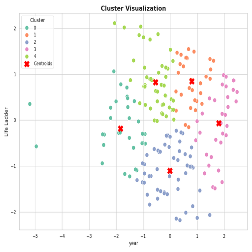

# Summary Insight Report

### Executive Summary of Insights

The analysis provided a comprehensive overview of various quality of life indicators across different countries ranging from 2005 to 2023. Utilizing key metrics such as the Life Ladder, Log GDP per capita, and social support, as well as examining dimensions of emotional well-being, such as Positive and Negative affect, we can derive meaningful insights into the states of happiness, economic prosperity, and societal health across the globe.

### Insights Derived from the Analysis

#### Key Metrics Across Countries

1. **Life Ladder Index**: The average rating of 5.48 on the Life Ladder suggests a moderate level of life satisfaction among the sampled population, with a notable standard deviation of 1.13, indicating considerable variance in how different individuals perceive their quality of life.

2. **Economic Indicators**: The mean Log GDP per capita of approximately 9.40 reflects a diverse range of economic conditions, influenced by omitted data in 28 instances. This highlights gaps where certain countries may not be sufficiently integrated into the economic analysis, affecting overall insights.

3. **Social Support**: With a mean score of about 0.81 for social support, it indicates that in general, individuals feel they have adequate support from their families, friends, and community. The absence of values in 13 records combined with varying performance across countries could flag a potential area of concern in regions with significant social isolation.

4. **Health Metrics**: The Healthy life expectancy sits at an average of 63.40 years, with a wide standard deviation, suggesting disparities in health outcomes likely influenced by socioeconomic conditions, healthcare availability, and lifestyle factors.

5. **Freedom and Affect**: Insights indicate a mean value of 0.75 for Freedom to make life choices, which underscores a general sense of autonomy among populations. However, with 36 missing values, further investigations need to be warranted in determining the barriers faced by those lacking such freedoms.

#### Emotional Well-Being

The average Positive affect score is 0.65, while Negative affect averages at 0.27, pointing towards a generally positive emotional landscape in the data, but considerable room exists for improvement in reducing negative emotions through enhanced support networks and quality of life programs.

### Trends and Comparisons

The analysis exposes a trend of increasing life satisfaction in wealthier nations. Countries with higher GDP per capita typically report higher scores on the Life Ladder. This correlation can be instrumental for strategic planning aimed at boosting economic growth, which in turn may lead to improved happiness scores.

Conversely, countries struggling economically often exhibit lower life satisfaction and heightened negative affect scores. This juxtaposition could be essential for NGOs and governmental bodies directing efforts toward social programs aimed at community building, mental health support, and employment initiatives in these regions.

### Visualizations Insights

#### Cluster Visualization (Image 1)

The cluster visualization effectively categorizes countries based on shared characteristics in life satisfaction, economic health, and social factors. Such visualizations can pinpoint outliers—nations that, despite lower GDP, outperform in life satisfaction (or vice versa). Identifying these outlier countries could provide a blueprint for understanding effective policies or cultural dynamics contributing to their success.

### Actionable Insights

1. **Policy Formation**: Governments may leverage correlations between economic growth and life satisfaction to devise policies that encourage sustainable economic development while fostering community well-being.

2. **Targeted Interventions**: As seen with the gaps in social support and health metrics, targeted interventions in nations showing discrepancies could bolster overall happiness and stability.

3. **International Cooperation**: Addressing corruption and enhancing freedom must be a priority for countries reporting high negative affect and low social support. International partnerships could help in resource sharing and developing tools to foster transparency and accountability.

### Conclusion

The findings from the dataset highlight both gaps and opportunities for enhancing quality of life on a global scale. The interplay between economic, social, and emotional factors creates an intricate tapestry that offers insights for stakeholders across multiple sectors. Strategic efforts that promote economic development while simultaneously investing in social and health supports can yield significant returns in public happiness and well-being. Through ongoing analysis, we can continue to refine our understanding, ensuring that the insights translate into effective, evidence-based policymaking that resonates across borders.

## Appendix 
## Summary Statistics of the given data
|                                  |   count |     mean |   std |      min |      25% |      50% |      75% |      max |
|:---------------------------------|--------:|---------:|------:|---------:|---------:|---------:|---------:|---------:|
| year                             |    2363 | 2014.76  | 5.059 | 2005     | 2011     | 2015     | 2019     | 2023     |
| Life Ladder                      |    2363 |    5.484 | 1.126 |    1.281 |    4.647 |    5.449 |    6.324 |    8.019 |
| Log GDP per capita               |    2335 |    9.4   | 1.152 |    5.527 |    8.506 |    9.503 |   10.392 |   11.676 |
| Social support                   |    2350 |    0.809 | 0.121 |    0.228 |    0.744 |    0.834 |    0.904 |    0.987 |
| Healthy life expectancy at birth |    2300 |   63.402 | 6.843 |    6.72  |   59.195 |   65.1   |   68.552 |   74.6   |
| Freedom to make life choices     |    2327 |    0.75  | 0.139 |    0.228 |    0.661 |    0.771 |    0.862 |    0.985 |
| Generosity                       |    2282 |    0     | 0.161 |   -0.34  |   -0.112 |   -0.022 |    0.094 |    0.7   |
| Perceptions of corruption        |    2238 |    0.744 | 0.185 |    0.035 |    0.687 |    0.798 |    0.868 |    0.983 |
| Positive affect                  |    2339 |    0.652 | 0.106 |    0.179 |    0.572 |    0.663 |    0.737 |    0.884 |
| Negative affect                  |    2347 |    0.273 | 0.087 |    0.083 |    0.209 |    0.262 |    0.326 |    0.705 |

## Advanced Statistics
### Correlation Matrix
|                                  |   year |   Life Ladder |   Log GDP per capita |   Social support |   Healthy life expectancy at birth |   Freedom to make life choices |   Generosity |   Perceptions of corruption |   Positive affect |   Negative affect |
|:---------------------------------|-------:|--------------:|---------------------:|-----------------:|-----------------------------------:|-------------------------------:|-------------:|----------------------------:|------------------:|------------------:|
| year                             |  1     |         0.047 |                0.08  |           -0.043 |                              0.168 |                          0.233 |        0.031 |                      -0.082 |             0.013 |             0.208 |
| Life Ladder                      |  0.047 |         1     |                0.784 |            0.723 |                              0.715 |                          0.538 |        0.177 |                      -0.43  |             0.515 |            -0.352 |
| Log GDP per capita               |  0.08  |         0.784 |                1     |            0.685 |                              0.819 |                          0.365 |       -0.001 |                      -0.354 |             0.231 |            -0.261 |
| Social support                   | -0.043 |         0.723 |                0.685 |            1     |                              0.598 |                          0.404 |        0.065 |                      -0.221 |             0.425 |            -0.455 |
| Healthy life expectancy at birth |  0.168 |         0.715 |                0.819 |            0.598 |                              1     |                          0.376 |        0.015 |                      -0.303 |             0.218 |            -0.15  |
| Freedom to make life choices     |  0.233 |         0.538 |                0.365 |            0.404 |                              0.376 |                          1     |        0.321 |                      -0.466 |             0.578 |            -0.279 |
| Generosity                       |  0.031 |         0.177 |               -0.001 |            0.065 |                              0.015 |                          0.321 |        1     |                      -0.27  |             0.301 |            -0.072 |
| Perceptions of corruption        | -0.082 |        -0.43  |               -0.354 |           -0.221 |                             -0.303 |                         -0.466 |       -0.27  |                       1     |            -0.274 |             0.266 |
| Positive affect                  |  0.013 |         0.515 |                0.231 |            0.425 |                              0.218 |                          0.578 |        0.301 |                      -0.274 |             1     |            -0.334 |
| Negative affect                  |  0.208 |        -0.352 |               -0.261 |           -0.455 |                             -0.15  |                         -0.279 |       -0.072 |                       0.266 |            -0.334 |             1     |

### Covariance Matrix
|                                  |   year |   Life Ladder |   Log GDP per capita |   Social support |   Healthy life expectancy at birth |   Freedom to make life choices |   Generosity |   Perceptions of corruption |   Positive affect |   Negative affect |
|:---------------------------------|-------:|--------------:|---------------------:|-----------------:|-----------------------------------:|-------------------------------:|-------------:|----------------------------:|------------------:|------------------:|
| year                             | 25.598 |         0.267 |                0.465 |           -0.026 |                              5.823 |                          0.164 |        0.025 |                      -0.077 |             0.007 |             0.092 |
| Life Ladder                      |  0.267 |         1.267 |                1.01  |            0.099 |                              5.549 |                          0.085 |        0.032 |                      -0.09  |             0.062 |            -0.035 |
| Log GDP per capita               |  0.465 |         1.01  |                1.327 |            0.095 |                              6.464 |                          0.058 |       -0     |                      -0.075 |             0.028 |            -0.026 |
| Social support                   | -0.026 |         0.099 |                0.095 |            0.015 |                              0.502 |                          0.007 |        0.001 |                      -0.005 |             0.005 |            -0.005 |
| Healthy life expectancy at birth |  5.823 |         5.549 |                6.464 |            0.502 |                             46.822 |                          0.359 |        0.017 |                      -0.388 |             0.159 |            -0.089 |
| Freedom to make life choices     |  0.164 |         0.085 |                0.058 |            0.007 |                              0.359 |                          0.019 |        0.007 |                      -0.012 |             0.009 |            -0.003 |
| Generosity                       |  0.025 |         0.032 |               -0     |            0.001 |                              0.017 |                          0.007 |        0.026 |                      -0.008 |             0.005 |            -0.001 |
| Perceptions of corruption        | -0.077 |        -0.09  |               -0.075 |           -0.005 |                             -0.388 |                         -0.012 |       -0.008 |                       0.034 |            -0.005 |             0.004 |
| Positive affect                  |  0.007 |         0.062 |                0.028 |            0.005 |                              0.159 |                          0.009 |        0.005 |                      -0.005 |             0.011 |            -0.003 |
| Negative affect                  |  0.092 |        -0.035 |               -0.026 |           -0.005 |                             -0.089 |                         -0.003 |       -0.001 |                       0.004 |            -0.003 |             0.008 |

