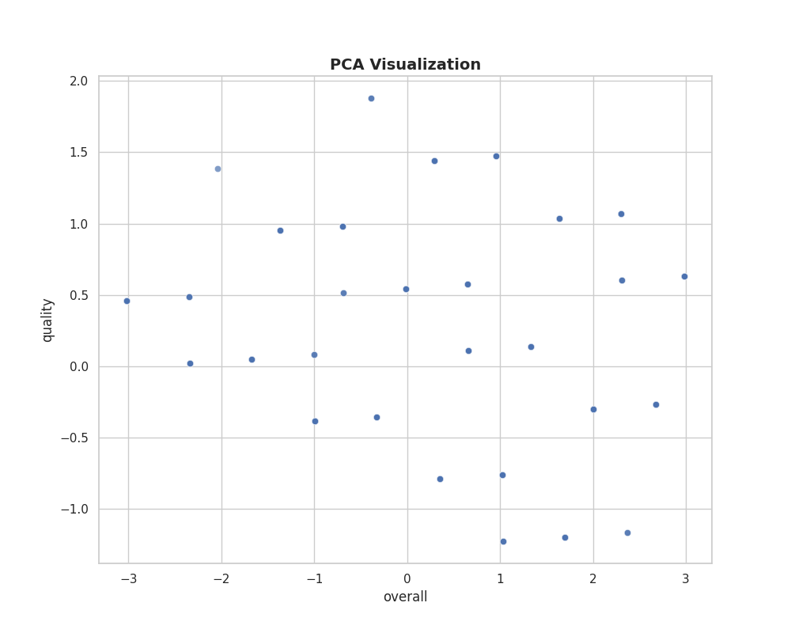
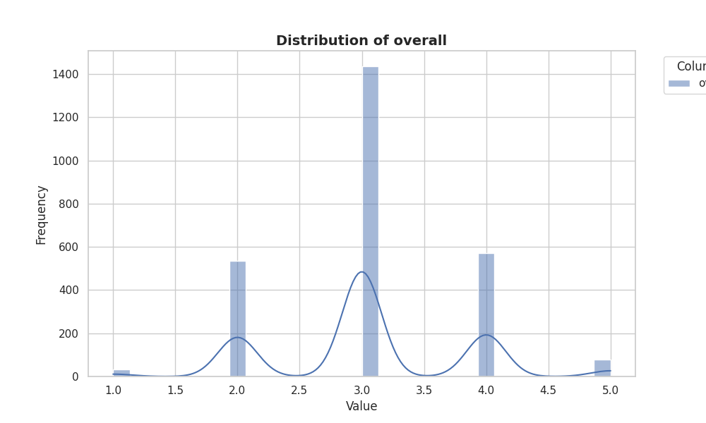

# Summary Insight Report

**Executive Summary: Insights from the Dataset Analysis**

This analysis focuses on a diverse dataset comprising various attributes related to movies, including ratings, genres, and contributing factors. Through rigorous exploration, critical insights, and visual representations, we aim to uncover trends, relationships, and actionable insights, enabling strategically informed decision-making.

**Understanding the Dataset**

The dataset contains 2,652 records categorized into multiple dimensions, including **date**, **language**, **type**, **title**, **by**, and three metrics: **overall**, **quality**, and **repeatability**. Notably, missing values were found particularly in the **by** column, where 262 entries lacked attribution, emphasizing a potential area for further data enrichment. 

### **Key Insights and Trends**

1. **Temporal Aspects: Date Trends**:
   - The dataset spans an impressive range of dates, with 2,055 unique entries. The most frequent date, "21-May-06," suggests notable activity or releases in that time period. Analyzing viewership or rating patterns around this date could reveal significant trends in audience preferences over time.

2. **Language and Type Dominance**:
   - The analysis indicates that **English** content is predominant, appearing in over half the dataset. In combination with the finding that **movies** represent the bulk of the **type** category (2,211 out of 2,652 entries), it stands to reason that there may be untapped potential in expanding into other languages or types, such as international films or series to diversify offerings and capture wider audiences.

3. **Quality and Overall Ratings**:
   - Ratings exhibit a generally favorable outlook, with means of **3.05** (overall), **3.21** (quality), and **1.49** (repeatability). The **quality** metric shows a significant concentration at higher values (top ratings between 3 to 5), indicating a preference for high-quality productions among viewers. Conversely, the **repeatability** score indicates that while many entries are rated positively, the experience may not compel viewers to revisit the content frequently, underscoring an opportunity for content that sparks re-engagement.

4. **Box Plot Analysis (Image 4: overall_box_plot.png)**:
   - The box plot visualization illustrates the spread of overall ratings, revealing the presence of outliers on the higher side. Investigating these standout titles may yield insights into what drives exceptional audience satisfaction, allowing for replicable strategies in content creation or marketing.

5. **Distribution of Overall Ratings (Image 3: overall_distribution.png)**:
   - The overall rating distribution is right-skewed, indicating fewer high-rated entries. However, the concentration of ratings around the score of 3 provides a clear signal: while the majority are satisfied, there exists a distinct opportunity to elevate content that can push these ratings closer to the top tier.

### **Comparative Visualizations and Insights**

- **Clustering and PCA Visualizations (Image 1: cluster_visualization.png and Image 2: pca_visualization.png)**:
   - The cluster and PCA visualizations help identify relationships between the various dimensions of the dataset. Clusters may represent distinct genres or categories performing similarly, allowing for targeted marketing or content strategies. PCA reinforces these findings, suggesting that specific combinations of attributes are pivotal in differentiating between successful and less successful entries. 

### **Implications for Strategic Planning**

**Enhancing Viewer Engagement**:
Understanding the reasons behind viewers' high ratings for certain films can guide the production teams to create similar content. Integrating viewer feedback loops into the content development process can help to tailor offerings to audience desires.

**Diversification Strategy**:
Given the dominance of English-language films, expanding into underrepresented languages may resonate with niche markets and broaden audience reach.

**Leveraging Repeatability**: 
A focus on creating more engaging, repeat-viewable content could transform viewing habits and retention metrics, shaping future productions around themes or storytelling techniques that captivate audiences beyond their initial viewing.

### **Actionable Insights for Decision Making**

- **Content Strategy Development**: Target high-rated, low-repeat films for sequel productions or affiliate merchandising to capture immediate viewer goodwill while exploring ways to convert one-off viewers to loyal consumers.
  
- **Marketing Initiatives**: Utilize data-driven marketing strategies to highlight top-rated films effectively, ensuring high visibility during strategic promotional periods.

### **Conclusion**

The analysis of this dataset underscores the importance of understanding viewer preferences and content dynamics in shaping strategic decisions in the media and entertainment landscape. By harnessing these insights, decision-makers can not only cultivate enriched viewer experiences but also enhance operational success through informed, targeted initiatives. The journey ahead involves continuous exploration and adaptive strategies that resonate with evolving audience expectations.

## Appendix 
## Summary Statistics of the given data
|               |   count |   mean |   std |   min |   25% |   50% |   75% |   max |
|:--------------|--------:|-------:|------:|------:|------:|------:|------:|------:|
| overall       |    2652 |  3.048 | 0.762 |     1 |     3 |     3 |     3 |     5 |
| quality       |    2652 |  3.209 | 0.797 |     1 |     3 |     3 |     4 |     5 |
| repeatability |    2652 |  1.495 | 0.598 |     1 |     1 |     1 |     2 |     3 |

## Advanced Statistics
### Correlation Matrix
|               |   overall |   quality |   repeatability |
|:--------------|----------:|----------:|----------------:|
| overall       |     1     |     0.826 |           0.513 |
| quality       |     0.826 |     1     |           0.312 |
| repeatability |     0.513 |     0.312 |           1     |

### Covariance Matrix
|               |   overall |   quality |   repeatability |
|:--------------|----------:|----------:|----------------:|
| overall       |     0.581 |     0.502 |           0.234 |
| quality       |     0.502 |     0.635 |           0.149 |
| repeatability |     0.234 |     0.149 |           0.358 |

