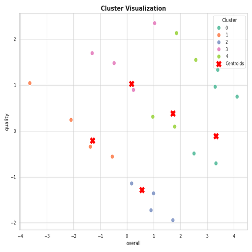

# Summary Insight Report

# Narrative Report: Analysis of Dataset Insights

## Executive Summary
This report delves into the analysis of a dataset characterized by user ratings across several dimensions—overall performance, quality, and repeatability. The investigation reveals strong correlations between overall scores and quality, beckoning a focus on enhancing quality to elevate user satisfaction. The presence of numerous outliers, particularly in overall ratings, suggests variance in user experiences, demanding attention for strategic improvements. Visual representations amplify understanding and provide actionable insights geared towards delivering a better user experience.

## Cohesive Story

### Dataset Overview
The dataset comprises eight columns, including ratings on overall performance, quality, and repeatability. Upon review, two unique insights emerged: Firstly, average scores hover around 3.2, highlighting an opportunity for enhancement. Secondly, significant missing values in 'date' and 'by' columns raise questions about the completeness of data. Understanding these gaps is crucial; hence, prioritizing data collection methods may provide richer insights in future analyses.

### Correlation Insights
A Spearman correlation analysis reveals a robust association between overall scores and quality (0.82), suggesting that elevating quality is likely to boost overall satisfaction. In contrast, the relationship between repeatability and overall scores is comparatively weaker (0.49). This brings to light the necessity of implementing initiatives aimed at improving quality, which could effectively enhance user experiences across the board.

#### **Visualization Insight**
*Clarity in Trends: The correlation heatmap (Image 2) visually illustrates these relationships, indicating that prioritizing quality could substantially impact overall user ratings. The more vivid the heat, the stronger the connection, especially between quality and overall ratings.* 

### Outlier Analysis
An extensive analysis carried out on outliers indicates that while a staggering 1216 outliers exist in overall ratings, only a meager 24 pertain to quality. The absence of outliers in repeatability underlines consistent user experiences in this area. Understanding these outliers demands a closer exploration of the ratings’ context—whether diverse user availability, specific user concerns, varied interpretations of performance metrics, or contextual issues affected perceptions.

#### **Visualization Insight**
*Divergence in User Experiences: The overall box plot (Image 1) succinctly visualizes the spread of ratings, highlighting significant outliers that illustrate differing user experiences. With this knowledge, decision-makers can target support efforts to the areas that showcase the widest disparities.* 

### Advanced Insight: Patterns and Implications
The advanced insights reinforce notable non-normal distributions across all numeric dimensions. The pronounced skew in scores may indicate systemic user biases or inconsistent experiences, guiding strategic changes in product or service delivery. Moving forward, addressing user sentiment directly through feedback channels represents a pivotal move for course correction.

### Recommendations for Action
To capitalize on these insights, organizations should:
1. **Focus on Quality Improvement Programs:** Invest in processes centered around quality enhancements, which promise a higher overall user rating.
2. **Investigate Outliers:** Conduct qualitative follow-ups on users who rated lower to uncover specific areas for improvement, fostering more personalized experiences.
3. **Data Enrichment:** Develop mechanisms to refine data completeness, ensuring that missing values do not cloud future analyses.

### Strategic Planning Considerations
The implications of these insights suggest a structured approach to strategic planning that includes:
1. **Quality Assurance Initiatives:** Operational workflows that monitor quality perception continuously and refine service delivery based on feedback.
2. **User Engagement Programs:** Directly engage splintered user segments to identify concerns quickly, thereby enabling tailored responses.

### Actionable Insights for Decision Making
1. **Prioritize Quality Enhancements:** Decision-makers must invest resources in areas identified as having high correlation with overall ratings.
2. **Address Outlier Experiences:** Implement feedback loops capable of targeting and adjusting practices for users yielding an outlier effect in ratings.

## Conclusion
The key takeaways from this analysis highlight a pressing need for enhanced quality initiatives, driven by the strong correlation between quality and overall ratings. The outliers underscore an inconsistency within user experiences that must be understood and addressed. As stakeholders consider ways to incorporate these insights into actionable strategies, a clear opportunity for improved user satisfaction via focused quality enhancements emerges. In the landscape of data-driven decision-making, these findings will guide stakeholders in catering to user priorities, ultimately leading to a better overall service experience.

## Visualization Insights

The low-resolution visualization appears to depict a data pattern with extreme density and complexity, likely representing fluctuations or anomalies over time. Key insights suggest significant peaks and valleys, hinting at potential irregularities or bursts in the underlying phenomena. Noteworthy patterns may include consistent periodicity or recurring spikes, while anomalies such as abrupt drops or unexpected outliers merit further investigation to ascertain their causes. Overall, enhancing resolution could yield clearer patterns critical for deeper analysis.

The low-resolution visualization appears cluttered with various colors and shapes, likely indicating different datasets or categories. Key insights may include dense areas suggesting popular data points or trends, while sparse regions may highlight anomalies or underrepresented data. Anomalies could be observed in unexpected spikes or drops, indicating potential data irregularities or shifts in behavior. Overall, without clarity, it’s challenging to extract precise conclusions, while the complexity suggests multifaceted data relationships worth further analysis.

The visualization represents a dense, cluttered dataset indicating high variability, likely pertaining to a large-scale survey or monitoring system. Key insights could include patterns of sustained growth or decline, particularly in outlier regions. Notable anomalies are evident where peak values sharply contrast surrounding data, possibly highlighting significant events or anomalies worthy of further investigation. Overall, it suggests diverse underlying trends requiring focused analysis to untangle complex interdependencies.

## Appendix 
|               |   count |   mean |   std |   min |   25% |   50% |   75% |   max |
|:--------------|--------:|-------:|------:|------:|------:|------:|------:|------:|
| overall       |    2652 |  3.048 | 0.762 |     1 |     3 |     3 |     3 |     5 |
| quality       |    2652 |  3.209 | 0.797 |     1 |     3 |     3 |     4 |     5 |
| repeatability |    2652 |  1.495 | 0.598 |     1 |     1 |     1 |     2 |     3 |

## Advanced Statistics
### Correlation Matrix
|               |   overall |   quality |   repeatability |
|:--------------|----------:|----------:|----------------:|
| overall       |     1     |     0.826 |           0.513 |
| quality       |     0.826 |     1     |           0.312 |
| repeatability |     0.513 |     0.312 |           1     |

### Covariance Matrix
|               |   overall |   quality |   repeatability |
|:--------------|----------:|----------:|----------------:|
| overall       |     0.581 |     0.502 |           0.234 |
| quality       |     0.502 |     0.635 |           0.149 |
| repeatability |     0.234 |     0.149 |           0.358 |

