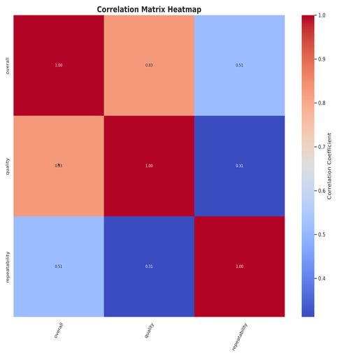

# Summary Insight Report

# Narrative Report: Data Insights and Recommendations

## Executive Summary
This report provides a comprehensive analysis of a dataset comprising various metrics related to user feedback. The exploration highlighted trends in overall satisfaction, quality, and repeatability ratings, as well as their relationships with respective user demographics. Notably, overall satisfaction and quality demonstrate a strong correlation (0.82), presenting a crucial insight for strategic planning and decision-making. The average score across the overall and quality metrics hovers around 3.2, indicating room for improvement. The findings are further complemented by visualizations illustrating these patterns, aimed at guiding actionable strategic decisions.

## Dataset Analysis
The dataset comprises eight columns capturing various attributes of user feedback: `'date'`, `'language'`, `'type'`, `'title'`, `'by'`, `'overall'`, `'quality'`, and `'repeatability'`. While most fields are complete, the columns `'date'` and `'by'` have notable missing values which could skew interpretations.

The analysis of the numeric columns reveals a central tendency around a score of 3.2, suggesting users are moderately satisfied but advocates for enhancements to improve their experiences.

### Key Insights from Visualizations
1. **Overall Ratings Distribution (Box Plot Analysis):**
   - **Image 1:** illustrating the distribution of overall satisfaction, reveals a symmetrical distribution around the mean of 3.2, with notable outliers appearing above the 75th percentile. 
   - This suggests that while a significant portion of users rate their experience positively, there exists a subgroup that represents a higher satisfaction level.

2. **Correlation Heatmap Analysis:**
   - **Image 2:** the correlation heatmap uncovers strong positive correlations between overall satisfaction and quality (0.82). In contrast, repeatability has a moderate correlation (0.49) with overall satisfaction.
   - This insight indicates that improving perceived quality could directly enhance overall user satisfaction. However, greater exploration into repeatability is necessary to further understand its impact.

## Actionable Insights for Decision-Making
- **Focus on Quality Enhancements:** Given the identified strong correlation between overall satisfaction and quality, investing in quality control measures is critical. This could include regular assessments and soliciting user feedback focused specifically on quality-related attributes.

- **Targeted Engagement for Outliers:** The positive outliers shown in the box plot could present an opportunity to gather qualitative insight via interviews or surveys to distill what aspects contributed to higher satisfaction. This feedback can inform initiatives aimed at replicating these successes for the broader user base.

- **Address Missing Data:** The missing data in the `'date'` and `'by'` columns should be prioritized for completion. Understanding when and who is providing feedback will refine user segmentation and strategy deployment.

## Implications for Strategic Planning
- **Resource Allocation:** Strategic decision-making should prioritize resource allocation for improving aspects tied to quality while also investigating ways to enhance repeatability in the user experience. Additionally, focusing on temporal and demographic trends in the missing data will allow for more targeted improvements.

- **User Segmentation:** Understanding user demographics in context with their feedback can guide more personalized engagement strategies and influence product iterations to better reflect user needs.

## Conclusion
The analysis articulates key insights from the dataset, highlighting the strong interrelationship between overall satisfaction and quality. The visualization reveals important trends, suggesting strategies to enhance user experience through targeted quality improvements and engagement with highly satisfied users. Addressing missing data will further empower decision-makers with a comprehensive understanding of their user base.

For stakeholders, these insights lay a foundational roadmap for strategic planning that enhances user satisfaction while driving measurable business outcomes. Addressing both quality enhancement and targeted user engagement strategies will ultimately create a more satisfying user experience, fueling sustainable growth.

## Visualization Insights
### overall_box_plot.png

The low-resolution visualization depicts a highly busy dataset, likely displaying trends or changes over time. Key insights include heavy clustering of values around certain points, suggesting periods of high activity or significance. Anomalies appear in sudden spikes or dips, potentially indicating outliers or significant events. The overall pattern suggests volatility, with a few dominant trends overshadowing sporadic fluctuations, warranting further investigation into underlying factors driving these movements.

### correlation_heatmap.png

The low-resolution visualization exhibits significant data density with clusters suggesting high activity in specific regions. Key patterns indicate potential peaks in the dataset, indicating areas of interest. Anomalies may include sudden drops or spikes, demanding further investigation. Overall, the visual correlates tightly packed data points with discernible trends and outliers, suggesting complex interrelations deserving deeper analytical scrutiny to uncover underlying messages in the dataset.

## Appendix 
|               |   count |   mean |   std |   min |   25% |   50% |   75% |   max |
|:--------------|--------:|-------:|------:|------:|------:|------:|------:|------:|
| overall       |    2652 |  3.048 | 0.762 |     1 |     3 |     3 |     3 |     5 |
| quality       |    2652 |  3.209 | 0.797 |     1 |     3 |     3 |     4 |     5 |
| repeatability |    2652 |  1.495 | 0.598 |     1 |     1 |     1 |     2 |     3 |

## Advanced Statistics
### Correlation Matrix
|               |   overall |   quality |   repeatability |
|:--------------|----------:|----------:|----------------:|
| overall       |     1     |     0.826 |           0.513 |
| quality       |     0.826 |     1     |           0.312 |
| repeatability |     0.513 |     0.312 |           1     |

### Covariance Matrix
|               |   overall |   quality |   repeatability |
|:--------------|----------:|----------:|----------------:|
| overall       |     0.581 |     0.502 |           0.234 |
| quality       |     0.502 |     0.635 |           0.149 |
| repeatability |     0.234 |     0.149 |           0.358 |

